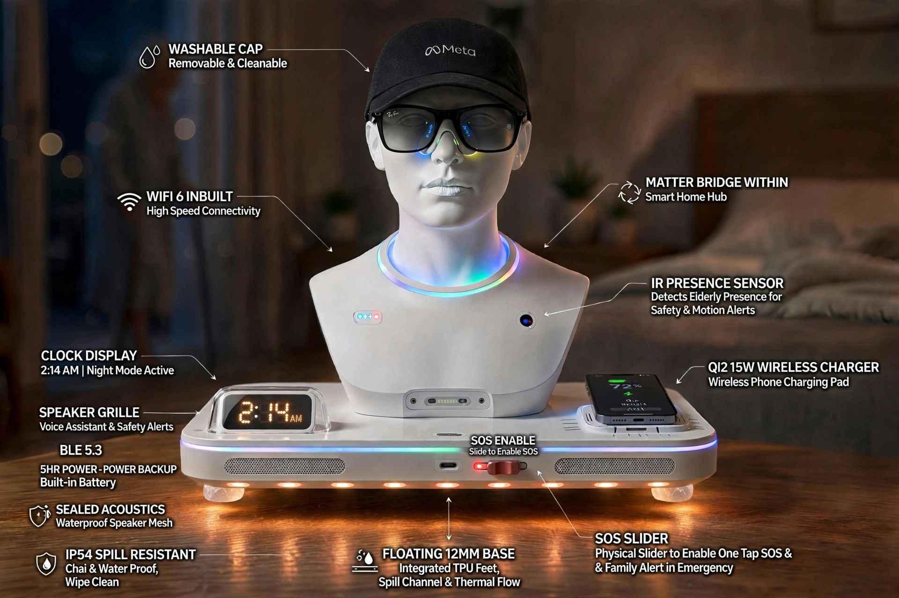
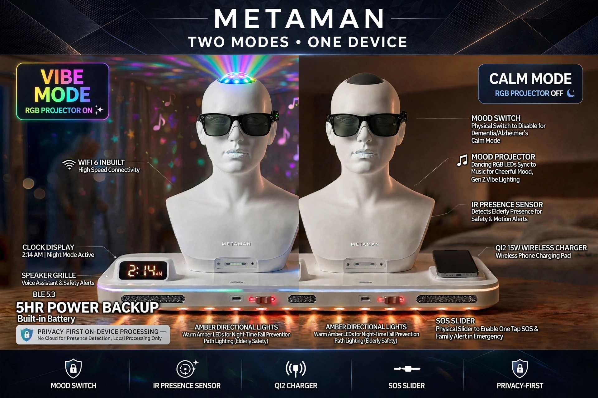
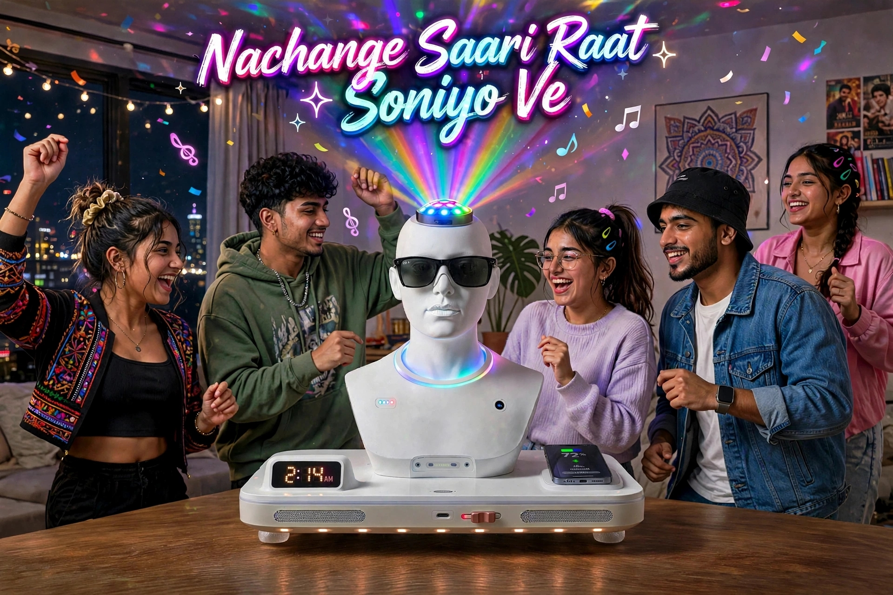
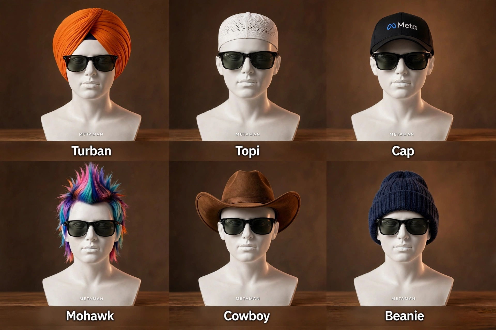
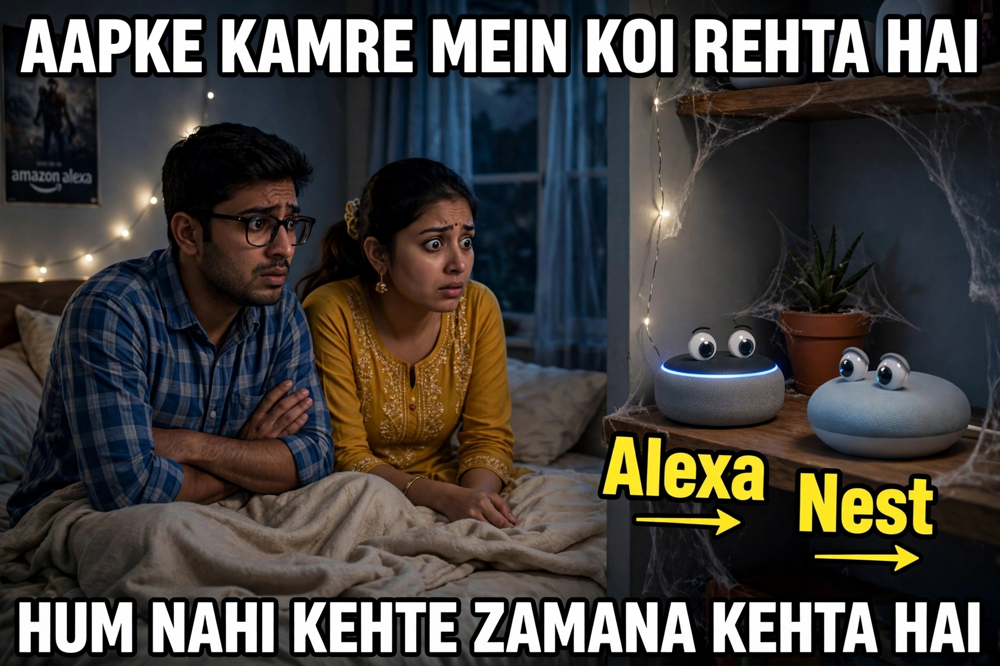
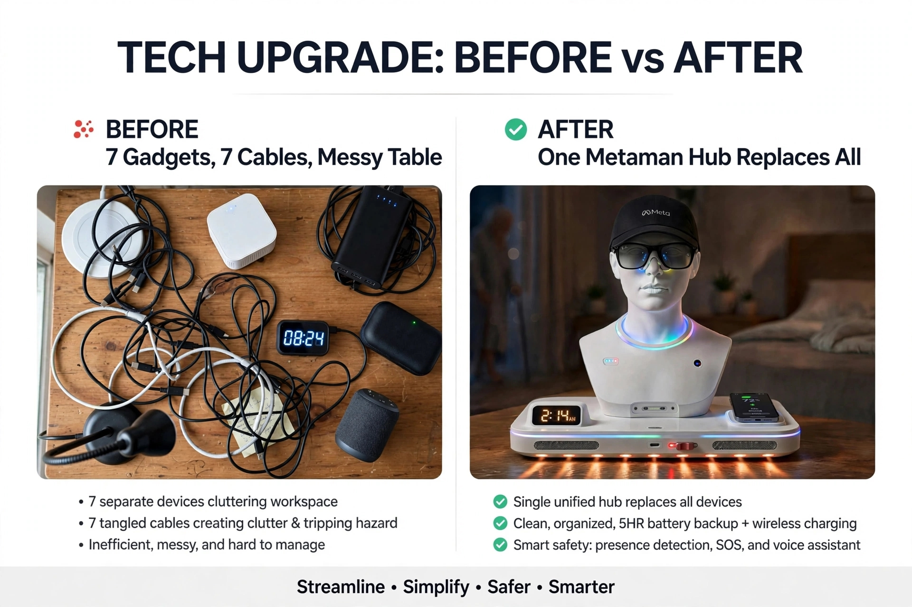

# Metaman-dhyaan - Two Modes, One Device
### Chai-proof elderly companion bust, Llama-powered, for night safety & dementia calm. Vibe + Calm Mode. Designed in Delhi. Concept, not official Meta product.
> **LIVE UPDATE 12 Oct:** V2 VIBE HUB Added - Same hardware, RGB OTA update. See Llama Cookbook Issue #1082 (Open)

**Idea & Concept: Rajan | Visualized with help of Meta AI**

### Evolution Log
- v1.0 (1 Oct): Care Hub only - mailed to accessibility@meta.com
- v1.5 (4 Oct): Issue #1082 posted
- v2.0 (12 Oct): Dual Market - Care for Accessibility + Vibe for Meta Store

### V1 CARE HUB - 10:30 PM Amber

- Clock 2:14 AM, Amber directional lights, IR sensor, SOS slider, Qi2 15W, 5HR backup, IP54 chai-proof, washable Meta cap, Matter Bridge

### V2 VIBE HUB - 11:14 PM RGB - NEW

- Same bust, 100 options: Turban / Topi / Beanie / Mohawk / Cowboy / Meta Cap
- Music reactive RGB, IG Purple / FB Blue notifications

### TECH UPGRADE: BEFORE vs AFTER

7 Gadgets, 7 Cables -> One Metaman Hub Replaces All

Looking for feedback from Llama Gadgets / Wearables team.
