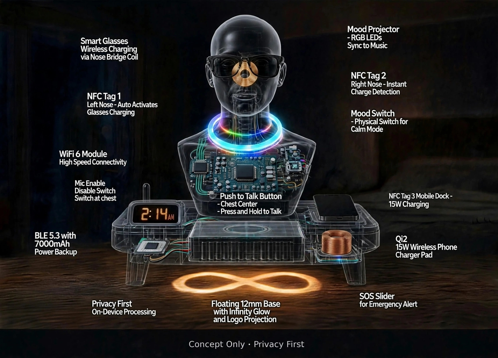
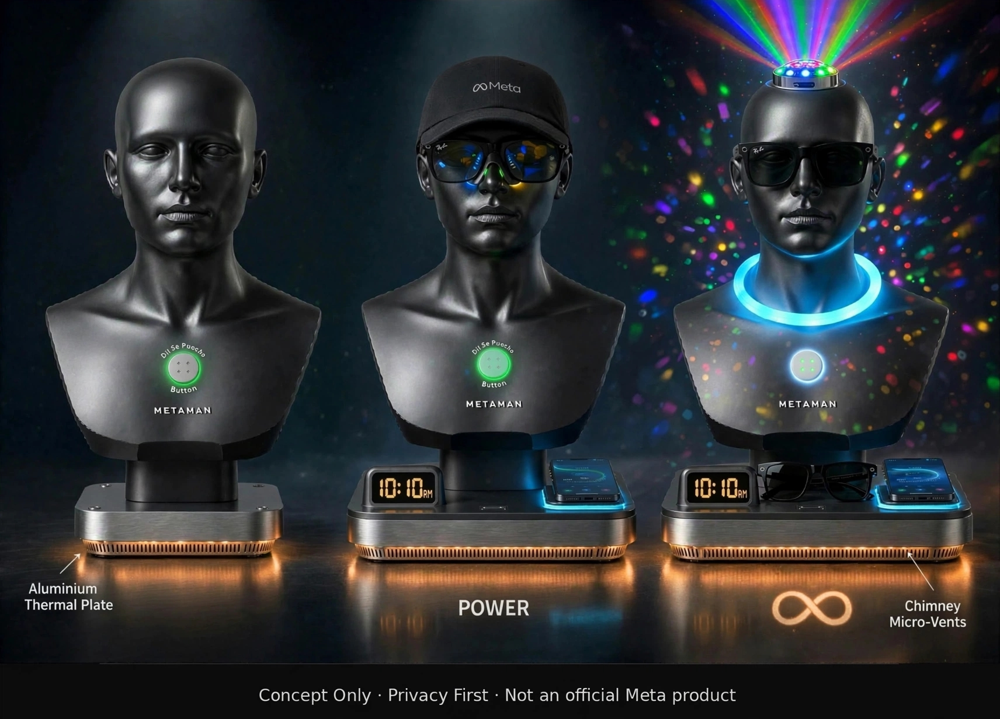

# METAMAN Dhyaan - Independent Concept by Rajan | Proposed for Meta Platforms (Licensing Discussion)
> Licensed under CC BY-NC 4.0 - Commercial use, production or derivative products require explicit permission from the author. Contact for licensing: getrajanchitkara@gmail.com
# METAMAN DHYAAN - Wellness Charging Shrine (Concept Only)
### From 7 Cables to 1 Dhyaan | 20 Features Live, 23 Features Ready

> Concept Only • Privacy First • Not an official Meta product
> First Published: 1 Oct 2026 via accessibility@meta.com | Llama Issue #1082: 4 Oct 2026
> v2.8 LIVE: 8 Oct 2026 (11 Slides) | v2.9.3 LIVE: 9 Oct 2026

### WHAT IS IT?
India ka pehla Chai-Proof, Wipe-Clean, IP54 Wellness Charging Shrine.
Dadi ke liye 2:14 AM ka solution - Time + Dim Light + Charged Phone + Glasses ek jagah.

**Tagline:** "Itne saare gadgets ka jhamela khatam, bas ek Metaman and you are sorted"

### HERO SHOT - v2.9.3 X-RAY VIEW
   
- Floating 12mm Base with Infinity Glow and Logo Projection
- 2:14 AM Clock (Date + Time + Temp on same display)
- Nose Bridge Coil for Smart Glasses Charging
- Qi2 15W Phone Pad with Chai Gutter System

## v2.8 - LIVE ON GITHUB - 20 FEATURES (LOOSELY 18 → NOW 20)

### CLOCK & DISPLAY (3)
1. Digital Clock Face - Low-glare 2:14 AM Always-on
2. Date Display - Discreet feature on same clock
3. Temperature Display - Room temp on clock

### CHARGING (4)
4. Qi2 15W Wireless Phone Charger Pad - With NFC Tag 3 Mobile Dock
5. Smart Glasses Wireless Charging via Nose Bridge Coil - Nose Dock + Ring Light
6. BLE 5.3 with 7000mAh Power Backup - 5HR Full / 2HR Slim
7. Reverse Charging Type-C Port

### SMART HOME & CONNECTIVITY (5)
8. Matter Bridge - Controls all smart home
9. WiFi 6 Module - High Speed Connectivity
10. BLE 5.3 - Fast Pair + Presence
11. Music Integration - Spotify / Gaana / Apple / Amazon
12. NFC Tag 1 Left Nose - Auto Activates Glasses Charging + NFC Tag 2 Right Nose - Instant Charge Detection

### AI & PRIVACY (4)
13. Push to Talk Button - Chest Center - Press and Hold to Talk (Dil Se Poocho)
14. Mic Enable Disable Switch - Switch at chest - Physical Privacy
15. Privacy First On-Device Processing - No Always-Listening
16. Find My Glasses - "Glasses dhoondho" beep

### LIGHT & MOOD (4)
17. Mood Projector - RGB LEDs Sync to Music - Head Projector
18. Mood Switch - Physical Switch for Calm Mode (VIBE/CALM) - RGB OFF physically
19. Notification Wire LED on Neck - Selective Alerts (Family Only)
20. Breathable Light on Neck + Floating Infinity Glow - Anxiety/Sleep + Night Path

### SAFETY & COMFORT
- SOS Slider for Emergency Alert - Red Slider + Family Alert + Llama Voice (Counted in 20)
- Covered Scent Diffuser Notch - Hidden ittar/oil
- Soft Amber Infinity Logo - Bottom glow

## v2.9.3 - PRIVATE UPGRADE - 23 FEATURES (20 + 3)

### NEW IN v2.9.3:
21. Motion Sensing Infinity Glow - Upgraded from IR Presence (Privacy-first, No IR/Camera/Cloud)
22. Aluminium Thermal Plate - Internal 2mm heat spreader - Fixes Dual Qi2 15W heat + Creates 35C Warmth Spot (Hand rest comfort)
23. Chimney Micro-Vents + Chai Gutter System - Passive Cooling + Chai-Proof Pad

#### CHAI GUTTER SYSTEM DETAILS (v2.9.3 Fix for Spill Question):
- Raised TPU Lip 1.5mm around Qi2 Pad - Contains spill
- 2 Side Spill Channels - Directs chai out, not inside
- Hydrophobic Nano Coating on coil - Beads liquid, rolls off
- Liquid Detection Pins - Auto Qi OFF on spill, Amber 2x blink "Saaf karo", Auto ON when dry
- Result: No Short Circuit, True Wipe Clean

#### CHIMNEY MICRO-VENTS DETAILS (IP54 Safe):
- Location: Bottom base near Infinity Glow, NOT top/side (Chai falls on top, heat exits bottom - Physics)
- Design: 0.8mm external slit -> 2mm U-turn Labyrinth -> PTFE Hydrophobic Mesh (Gore-Tex type)
- Function: Natural convection, no fan, silent for elderly
- IP54 Intact: Dust + splash protected like HomePod mini / Sonos

## WHY NO COMPETITOR HAS THIS COMBO

| Product | What it does | What it misses |
| --- | --- | --- |
| Hatch Restore / Loftie | Light + Sound + Alarm | No Charging, No Matter, No SOS, No Scent |
| Anker / Belkin 3-in-1 | Charging only | No Clock, No Mood, No AI |
| Echo Spot / Nest Hub | Screen + Always Listening | Privacy issue, Confusing for elderly, No Physical Kill Switch |
| METAMAN DHYAAN | 20-in-1 Wellness Charging Shrine | VIBE+CALM, Glasses Home, Chai-Proof |

**Moat:** 2:14 AM problem solved in 1 device - Time + Dim Light + Phone Charged + Glasses Found = 4 gadgets replaced.

## IP54 + WIPE CLEAN + CHAI-PROOF + NO FAN

- Top: Brushed Steel + Washable Silicone Cap
- Qi Pad: Sealed coil + Gutter + Nano + Auto Cut-off
- Bottom Vents: Labyrinth + Mesh = IP54 pass
- Claim: "Vents at bottom, chai falls on top. Physics."

## SLIDES

- /report/v2.8 - 11 Slides LIVE (20 Features with IR)
- /report/v2.9.3 - Add this X-Ray slide as Slide 12 - 23 Features with Thermal + Motion + Gutter

---
Concept Only • Privacy First • Wellness Charging Shrine
Built for Dadi, Loved by GenZ

**NEW in v2.9.3:** Passive cooling - Aluminium Thermal Plate + Chimney Micro-Vents (PTFE mesh, IP54 intact, no fan)
